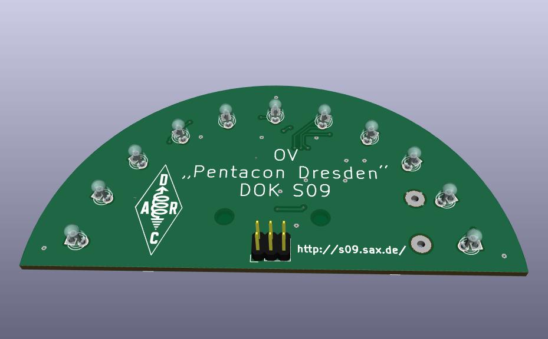
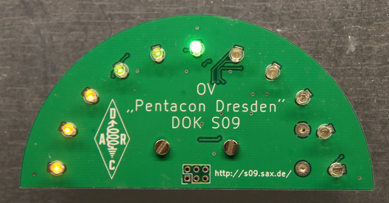

# LED Thermometer

Wer seine ersten Erfahrung mit Mikrocontrollern machen möchte, kann an
diesem Tag unter Anleitung diesen Bausatz aufbauen und dann natürlich
auch mitnehmen.

Ziel des Bausatzes ist es, eine nette elektronische Kleinigkeit
aufzubauen, die einerseits einen gewissen Nutzen hat. Andererseits
steht der Spaß und die Erfahrung beim Aufbau im Vordergrund,
entsprechend sollte der Bauteilpreis möglichst gering sein. Durch den
Einsatz von SMD-Bauteilen (Bauteile in Oberflächenmontage anstatt
durch Löcher zu steckender Drähte) für wesentliche Elemente außer den
LEDs selbst sowie eines Mikrocontrollers zum Realisieren der
eigentlichen Funktionalität soll ein Gefühl für zeitgemäße Elektronik
vermittelt werden. Die Wahl der Gehäusegrößen ist dabei ein Kompromiss
bezüglich der Handhabbarkeit für die Handlötung mit nur einfachen
Hilfsmitteln (Lupe und Pinzette).

## Bedienungsanleitung

Das Thermometer beginnt mit dem Einsetzen der Batterien mit seiner
Arbeit. Einen separaten Ein-/Ausschalter gibt es nicht. Die erwartete
Batterielebensdauer für zwei übliche LR03-Zellen (Alkaline) beträgt
mehrere Wochen. Die jeweils aktuelle Temperatur wird durch eine helle
LED signalisiert, die entweder blinkt (halber aktueller Skalenwert)
oder dauerhaft leuchtet (voller Skalenwert). Im Bandbetrieb (s.u.)
werden die LEDs links der aktuellen LED mit geringer Helligkeit
zusätzlich aktiviert, im Punktbetrieb bleiben sie dunkel. Ist die
Temperatur geringer als der untere Skalenwert, so blinkt die erste LED
abgedunkelt. Bei einer Temperatur oberhalb des Maximalwertes blinken
alle LEDs abgedunkelt.

Jumper JP1 legt die Wahl des Anzeigebereichs fest. Ist er gesteckt,
dann ist der vorgesehene Bereich 12 °C bis 32 °C, die mittlere LED
signalisiert 22 °C („Wohlfühltemperatur“ im Wohnzimmer). Ist er
gezogen, ist der Bereich von 0 °C bis 40 °C vorgesehen, mittlerer Wert
20 °C (Außentemperaturbereich).

(Gezogene Jumper steckt man zweckmäßig auf nur einen der beiden
Steckerstifte, damit sie nicht verloren gehen.)

Jumper JP2 schaltet, wenn er gesteckt wird, die Firmware in einen
Justiermodus. Damit kann die angezeigte Temperaturskala geschoben
werden, um Exemplarstreuungen des Temperatursensors
auszugleichen. Prinzipiell ist dadurch natürlich eine beliebige
Verschiebung der oben genannten Skalenbereiche realisierbar.

Zum Justieren benötigt man eine Pinzette o.ä., mit der sich immer zwei
Anschlüsse von J3 kurzzeitig verbinden lassen. Verbindet man dabei
Pins 1 und 6 (links unten und rechts oben), dann erhöht sich die
angezeigte Temperatur. Verbindet man Pin 3 und 6 (unten Mitte und
rechts oben), verringert sie sich. Schließlich kann man durch
Verbinden von Pin 4 und 6 (oben Mitte und rechts oben) zwischen Band-
und Punktanzeige wechseln. Achtung! Niemals Pins 2 und 6 verbinden
(links und rechts oben), denn damit wird die Batterie kurzgeschlossen.

Nach erfolgter Justage wird JP2 wieder herausgezogen. Die
Einstellungen werden dann in einem nicht flüchtigen Speicherbereich
innerhalb des Mikrocontrollers hinterlegt, sodass sie auch nach einem
Batteriewechsel erhalten bleiben.

## Beschreibung der Schaltung

### Übersicht

Zentrales Element der Schaltung ist ein so genannter Mikrocontroller
(U1 im Schaltplan, nachfolgend „Controller“ genannt). Dabei handelt es
sich um einen kleinen Computer, der außer der CPU den kompletten
Programm- und Arbeitsspeicher auf dem Chip enthält sowie verschiedene
Peripheriegeräte, über die er mit seiner Umwelt kommunizieren
kann. Wie alle digitalen Schaltkreise in CMOS-Technik benötigt er
einen Kondensator an seinen Betriebsspannungsleitungen (C1), der wie
eine kleine Batterie wirkt für die teils sehr kurzen aber intensiven
Stromimpulse, die er im Betrieb aufnimmt.

Wesentliche vom Controller anzusteuernde Elemente sind die
Leuchtdioden (LEDs) D1 bis D11. Sie benutzen insgesamt 6 der
verfügbaren 11 Anschlüsse (Portpins). Von den verbleibenden 5
Anschlüssen werden drei für die Programmierschnittstelle J3
verwendet. Wenn das Programm läuft, kann man über diese drei
Anschlüsse außerdem die Justage der Temperaturanzeige sowie die
Umschaltung zwischen Punkt- und Bandbetrieb der LEDs vornehmen. Die
letzten beiden verbleibenden Portpins schließlich werden für die
Abfrage der beiden Steckbrücken (so genannte „Jumper“, JP1 und JP2)
benutzt.

Der Schaltungsteil links oben (U2, C2, R1) ist optional. Damit ließe
sich ein externer Temperaturfühler anschließen. Für den Bausatz wurde
vorerst vor allem aus Kostengründen auf diese Variante verzichtet, da
der im Controller enthaltene interne Sensor sich (nach Justage) als
ausreichend für diese kleine Thermometer-Schaltung erwiesen hat.

### Anschluss der LEDs

Die LEDs sind in Gruppen zu je sechs LEDs an je drei Portpins des
Controllers geschaltet. Jede einzelne LED wird dabei nur einen
Bruchteil der gesamten Zeit eingeschaltet. Die Trägheit des Auges
lässt uns dies als Dauerlicht erscheinen, sofern das Einschalten
häufig genug erfolgt. Grundsätzlich bezeichnet man eine solche
Anordnung als „(zeit-)multiplex“, der Sinn des Ganzen ist eine
Einsparung von Portpins im Vergleich zu einem direkten Anschluss der
LEDs (je LED ein Portpin). Im vorliegenden Fall wurde dabei die
„Charlieplexing“ genannte Variante der Anschaltung benutzt, die mit
sehr wenigen Portpins auskommt: wenn man N Portpins zur Verfügung hat,
kann man N · (N - 1) LEDs damit ansteuern. Dies wird möglich, indem
man die Pins dynamisch (sehr schnell, innerhalb von Mikrosekunden)
nicht nur als Ausgang mit positivem oder negativem Potenzial sondern
auch als „unbeteiligt“ (englisch tri-state) festlegen kann. Als
Nachteil entsteht dabei, dass man pro Zeiteinheit immer nur eine
einzige LED ansteuern kann. (Beim klassischen Multiplexing werden die
LEDs in einer Matrix angeordnet, und man kann pro Zeiteinheit bis zu
eine ganze Zeile bzw. Spalte gleichzeitig bedienen.) Die LED muss
daher innerhalb dieses Zeitschritts einen genügend hellen Lichtimpuls
erzeugen, damit der Lichteindruck im Auge ausreichend für die
nachfolgende lange Dunkelperiode ist. Als Kompromiss wurden daher die
vorgesehenen LEDs in zwei Gruppen zu je 6 LEDs eingeteilt, sodass jede
von ihnen, wenn sie eingeschaltet ist, 1/6 der Zeit von Strom
durchflossen wird.

Die sechste LED der zweiten Gruppe wurde weggelassen: mit einer
ungeraden Anzahl von LEDs ergibt sich bei der vorgesehenen
symmetrischen Skala eine einzelne LED, die genau in der Mitte liegt
und den Zentralwert der Anzeige darstellt (22 bzw. 20 °C, je nach
Messbereich).

Warum haben die LEDs nun keinen Vorwiderstände? Normalerweise kann man
eine LED nicht einfach direkt an eine Spannungsquelle wie eine
Batterie anschließen: ihre Betriebsspannung variiert stark mit der
LED-Farbe und unterliegt Exemplarstreuungen im Rahmen der Produktion
sowie verändert sich mit der Temperatur. Die Helligkeit der LED hängt
einigermaßen linear von der Stärke des Stroms ab, der durch sie
fließt. Daher schaltet man sie üblicherweise mit einem Vorwiderstand
an eine Spannungsquelle, über den der durch sie fließende Strom
festgelegt wird. In unserem Falle übernehmen die Ausgangstransistoren
im Controller die Funktion des Vorwiderstands. Durch den Betrieb mit
nur 3 V (Nennspannung) haben diese Transistoren bereits einen recht
hohen Innenwiderstand im eingeschalteten Zustand. Unsere LEDs wiederum
benötigen typisch etwas über 2 V Betriebsspannung für sich
(„Flussspannung“ genannt), es bleibt also ohnehin nur wenig
Spannungsdifferenz für die Vorwiderstände übrig. Da wir durch das
Multiplexing außerdem mit kurzen Lichtblitzen arbeiten, muss ohnehin
der Strom durch die gerade aktive LED 6mal so hoch sein, wie wenn man
sie dauerhaft mit Gleichstrom betreiben würde. Alles in allem genügt
daher die Anschaltung ohne zusätzliche Widerstände gerade so, dass die
LEDs im Multiplexbetrieb überhaupt noch die gewünschte Helligkeit
erreichen. Zusätzlicher Vorteil: es verringern sich die
Materialkosten, und es ist weniger Lötarbeit nötig. Als Nachteil muss
in Kauf genommen werden, dass sie mit entladener Batterie sichtbar
dunkler werden.

### Temperatursensor

Als Temperatursensor fungiert eine interne Schaltung im Controller, an
der bei entsprechender Aktivierung eine temperaturabhängige Spannung
entsteht. Diese wird mit einem so genannten ADC (Analog-Digital
Converter) in einen Computer-Zahlenwert umgewandelt und von da
entsprechend einer vom Hersteller angegebenen Formel
umgerechnet. Dabei ist infolge von Fertigungstoleranzen der Wert
dieser Spannung für eine bestimmte Temperatur (bspw. 20 °C) für ein
bestimmtes Controller-Exemplar nicht sehr exakt vorhersagbar, sodass
wir eine Möglichkeit zur Justage des fertigen Geräts benötigen. Die
Veränderung der entsprechenden Spannung mit der Temperatur (der
„Temperaturkoeffizient“ dieser Spannnung) hingegen ist weitgehend
durch physikalische Effekte dominiert und daher vorab bekannt, sodass
für einfache Anwendungen die Justage bei einer einzigen Temperatur
bereits ausreichend ist.

### Programmierschnittstelle

Als Programmierschnittstelle fungiert der 6polige Steckverbinder J3,
der sich unten in der Mitte der Platine befindet. Es handelt sich
dabei um eine so genannte ISP-Schnittstelle (In-System Programming),
d.h. der Controller muss zum Einbringen eines neuen Programms
(„Flashen“ genannt, da es im Controller in Flash-Speicherzellen
hinterlegt wird) nicht aus der Schaltung entnommen werden. Die für die
Programmierung benutzten Portpins lassen sich außerhalb des
Programmierbetriebs wie reguläre Portpins benutzen, weshalb wir sie
für die Justagemöglichkeit verwenden. Für die Programmierung selbst
benötigt man einen entsprechenden Programmieradapter, der die auf dem
PC vorliegende Firmware (also das Programm) dann über die
ISP-Schnittstelle in den Flash-Speicher des Controllers überträgt.

### Steckbrücken

Die „Jumper“ genannten Steckbrücken JP1 und JP2 werden benutzt, um im
Programm des Controllers Abläufe zu ändern. Zu diesem Zweck wird im
Controller ein kleiner Vorwiderstand von der positiven
Betriebsspannung angeschaltet. Ein gesteckter Jumper schließt dann
diese Spannung nach Masse (negative Betriebsspannung) kurz, und die
Software kann beim Abfragen des Pins diese Tatsache feststellen.
Beschreibung der Software

## Beschreibung der Software

### Allgemeines

Die Software für dieses Gerät wurde in der Programmiersprache C
geschrieben. Diese Sprache wurde in den 1970er Jahren beim
US-amerikanischen Telefonkonzern AT&T für die UNIX-Betriebssysteme
ihrer Computer entwickelt vor allem mit dem Ziel, auch sehr nahe an
der Hardware agierende Programmteile des Betriebssystems damit
realisieren zu können statt in der bis dahin üblichen Programmierung
in Assemblersprache. Aus diesem Grund ist diese Programmiersprache
mittlerweile für die Programmierung von Mikrocontrollern ebenfalls
sehr verbreitet, denn auch dort kommt es vor allem auf hardwarenahe
Programmierung an. Zum Anderen bietet sie einiges an Komfort bis hin
zur Formulierung mathematischer Ausdrücke mittels so genannter
Gleitkommazahlen, bei denen mit guter Genauigkeit von sehr kleinen bis
zu sehr großen Zahlen gerechnet werden kann. Dies wird im vorliegenden
Fall für die Umrechnung der Spannungswerte des Temperatursensors in
Temperaturwerte benutzt.

Aus dem in C geschriebenen Quellprogramm (Sourcecode) fertigt eine
Werkzeugkette (Toolchain) anschließend ein maschinenlesbares Programm
an, welches man bei Mikrocontrollern üblicherweise als „Firmware“
bezeichnet. Für das hier gezeigte Programm wird der freie, quelloffene
Compiler GCC einschließlich seiner Begleitwerkzeuge (GNU Binutils)
genutzt in der Variante für die AVR-Mikrocontroller der Firma
Microchip (vormals Atmel). Ergänzt werden sie dabei durch die
Programmbibliothek avr-libc, die für diese Controller-Famile viel
Unterstützung für den Zugriff auf die Hardware bietet. Zum Übertragen
der Firmware über die ISP-Schnittstelle wird schließlich zusammen mit
einem entsprechenden Adapter (Programmiergerät) die Software AVRDude
benutzt.

### Programmstruktur

Während Programme auf einem PC in der Regel einen Anfang und ein Ende
haben, läuft die Firmware eines Controllers nach ihrem Start
unbegrenzt weiter, solange sich dieser an der Versorgungsspannung
befindet. Daher wird die typische Programmstruktur einer
Controller-Firmware bestimmt durch Handlungen, die nur einmalig beim
Start erfolgen (Funktion setup()), gefolgt von einer Endlosschleife,
innerhalb der sich die eigentliche Funktion der Firmware befindet
(loop()). Diese Abfolge steht ganz am Ende des Quelltexts.

### `setup()`

Wesentliche Aufgabe dieser Funktion ist es, die Peripherie-Baugruppen
des Controllers in der gewünschten Weise einzurichten. Die vorliegende
Firmware benutzt vor allem drei Peripherieblöcke des Controllers:
einen Zeitgeber (TIMER1) zur zeitlichen Steuerung aller Abläufe, den
AD-Wandler (ADC) für das Einlesen des internen Temperatursensors sowie
die Portpins (PORT) zum Ansteuern der LEDs und Einlesen von Eingängen
(Jumper, Justierfunktion). Weiterhin wird der im Controller enthaltene
EEPROM genutzt, um die Justierdaten zu hinterlegen. Deren aktueller
Zustand wird daher beim Start des Programms eingelesen und im
Arbeitsspeicher abgelegt.

### `TIMER1`

Der Zeitgeber TIMER1 wird so programmiert, dass er mit 600 Hz
Umlauffrequenz arbeitet. Da jede LED jeder Gruppe 1/6 der Zeit
eingeschaltet ist, ergibt sich damit eine Wiederholfrequenz von 100 Hz
für die LEDs, was deutlich oberhalb der Flimmergrenze des menschlichen
Auges (ca. 30 Hz) ist. Zusätzlich löst der Durchlauf des Timers durch
1/20 seines Endwerts ein weiteres Ereignis (TIM1_COMPB_vect)aus,
welches dazu benutzt wird, dass die abgedunkelt dargestellten LEDs
wieder ausgeschaltet werden. Beim Erreichen des Endwerts
(TIM1_COMPA_vect) erfolgt ein Weiterschalten der LEDs innerhalb der
jeweiligen Gruppe. Für jeden Zeitschlitz wird dabei festgestellt, ob
die zugehörigen Portpins auf Ausgang/high, Ausgang/low oder hochohmig
(Eingang) geschaltet werden müssen. Diese Entscheidung erfolgt in der
Funktion led_update(). Die Funktion led_dim() entscheidet beim
Durchlauf des Timers durch 1/20 des Endwerts darüber, ob sich die
aktuelle LED in einem abgedunkelten Zustand („dim“) befindet und daher
vorzeitig abzuschalten ist.

Nach dem Weiterschalten des LED-Charlieplexings wird noch eine interne
Variable weitergezählt. Erreicht sie den halben Wert der Frequenz des
Zeitgebers (was nach 0,5 s der Fall ist), dann wird einerseits eine
neue Temperaturmessung im AD-Wandler gestartet, andererseits werden
die Werte der Justier-Anschlüsse eingelesen und intern in der
Variablen calib_jumpers hinterlegt. Daraus ergibt sich, dass die
Justierfunktion jeweils maximal ein Ereignis pro 0,5 s verarbeiten
kann.

### `ADC`

Der AD-Wandler ist dauerhaft voreingestellt auf Kanal 8, welcher mit
dem internen Temperatursensor verbunden ist. Nach dem Start durch den
Zeitgeber benötigt er eine kurze Zeit (knapp 2 ms), um sein Ergebnis
zu ermitteln. Dieses wird in der Interrupt Service Routine (ISR)
ADC_vect() in einer globalen Variablen adc_result hinterlegt, von wo
es später abgeholt wird, um die tatsächliche Temperatur zu
ermitteln. Dieser Wert ist erst einmal nur ein Zahlenwert, der die
gemessene Spannung relativ zu einer Referenzspannung in Höhe von 1,1 V
auf 1024 Schritte aufteilt; der Wert 0 entspricht also 0 V, der Wert
1023 entspricht 1,1 V.

### `display_temperature()`

In dieser Funktion erfolgt die Umwandlung des gemessenen
Spannungswertes vom Temperatusensor in die LED-Anzeige. Zuerst wird
dabei die Temperatur gemäß der Formel aus dem Datenblatt ermittelt
unter Berücksichtigung des Justierwertes (calib_data.t_offset). Danach
wird in Abhängigkeit davon, ob JP1 gesetzt oder gezogen ist,
ermittelt, welche LEDs wie zu aktivieren sind. Zuerst werden dabei
alle LEDs auf „OFF“ gesetzt, danach werden die LED-Muster für die
Temperaturanzeige in den Vektor leds[] eingetragen, aus dem dann der
Algorithmus fürs Charlieplexing die jeweiligen Aktivitäten an den
Portpins zyklisch ermittelt.

### Justierfunktion

Nachdem das LED-Muster für die aktuelle Temperatur ermittelt worden
ist, fragt die Funktion loop() die Stellung des Jumpers JP2 ab. Wird
bei diesem erkannt, dass ein bislang gesteckter Jumper
(Justierfunktion, Variable opmode im Programm hatte den Wert
CALIBRATION) nun gezogen worden ist, so werden die aktuellen
Justierdaten in den EEPROM zurückgeschrieben, damit sie bei einem
Neustart des Programms von da eingelesen werden können. Falls sich das
Programm im Justiermodus befindet, werden mit jedem
Halbsekundenschritt hier die entsprechenden Werte für
Band-/Punktbetrieb und Temperatur-Offset nachgeführt.

Nachdem die Funktion loop() dies erledigt hat, versetzt sie die CPU in
den Schlafzustand, um Energie sparen zu können. Die Peripheriegeräte
arbeiten in diesem Zustand entsprechend ihrer Programmierung
uneingeschränkt weiter und bestimmen damit den weiteren Ablauf.

### Update 2022-06-17

Die global Chipkrise bewirkt, dass wir für die anstehenden
Veranstaltungen in den TSD froh sind, statt der ursprünglichen
ATtiny44A wenigstens die kleineren ATtiny24A kaufen zu können. Leider
war der ursprüngliche Code geringfügig größer als die nunmehr zur
Verfügung stehenden 2048 Bytes im Flash. Ein wesentlicher Anteil des
ursprünglichen Flash-Verbrauchs ging darauf zurück, dass die Rechnung
mit Gleitkommazahlen durchgeführt worden ist, um den im Datenblatt
erwähnten Korrekturfaktor gegenüber dem Idealwert bei der
Temperaturmessung zu berücksichtigen. Da aber letztlich der
Korrekturfaktor zu 0,996 ermittelt worden war, also nur 0,4 %
Abweichung vom Idealfall, und da dieser geringe Unterschied mit der
recht groben Auflösung der 11 LEDs in der Anzeige kaum ins Gewicht
fällt, wurde er einfach weggelassen. Damit kann die komplette Rechnung
mit ganzen Zahlen (integer) erfolgen, und der Code passt nunmehr
bequem in den Flash des ATtiny24A hinein.